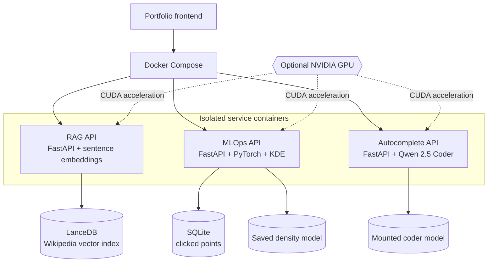

# Website Services

## Production-minded AI services for a modern web portfolio

This project is a collection of focused AI backends designed to support an interactive website. Instead of putting every capability into one application, it separates retrieval, machine-learning experiments, and developer tooling into small services with clear responsibilities.

## What I built

### Semantic knowledge search

A retrieval-augmented search service over a Wikipedia dataset. It converts natural-language questions into embeddings, searches a LanceDB vector index, removes duplicate sources, and returns ranked passages with their titles and URLs.

### Interactive spatial learning

An MLOps service that turns user interactions into a small, persistent dataset. It stores clicked coordinates, then compares classical Gaussian kernel density estimation with a trainable PyTorch neural density model. The result is a practical way to visualize how statistical and neural approaches learn the same spatial signal.

### AI code autocomplete

An inline completion service powered by Qwen 2.5 Coder. It supports both normal continuation and fill-in-the-middle prompts, allowing generated code to fit the content already written after the cursor.

## Engineering highlights

- FastAPI services with typed request and response models
- Lazy model loading during application startup
- CPU and CUDA execution with automatic device reporting
- Persistent vector, relational, and model data
- Health and readiness checks for reliable orchestration
- Docker Compose deployment with separate CPU and GPU configurations
- CORS support for integration with a browser-based portfolio frontend

## Architecture



Docker Compose is the deployment boundary: the portfolio calls service APIs, while each container owns its model lifecycle and application logic. Data and model files are mounted or persisted separately from the containers, so restarting a service does not discard learned or indexed data. The same services can run on CPU or use the GPU override for CUDA acceleration.

The services are intentionally independent. Each one can be monitored, scaled, or moved to GPU without coupling the rest of the application to its implementation details.

## Why this project

This is both a working backend foundation and a hands-on study of deploying machine-learning systems. It connects familiar web APIs with embeddings, vector search, density estimation, model persistence, GPU inference, and container orchestration.

The longer-term direction is to take the same services from local containers toward Kubernetes and AWS. The learning path is documented in [roadmap.md](roadmap.md).

```text
												 Web portfolio
															│
												 Service APIs
							┌───────────────┼───────────────┐
							▼               ▼               ▼
				Semantic search   Density Estimation   Code autocomplete
							│               │               │
					LanceDB       SQLite + PyTorch   Qwen 2.5 Coder
```
